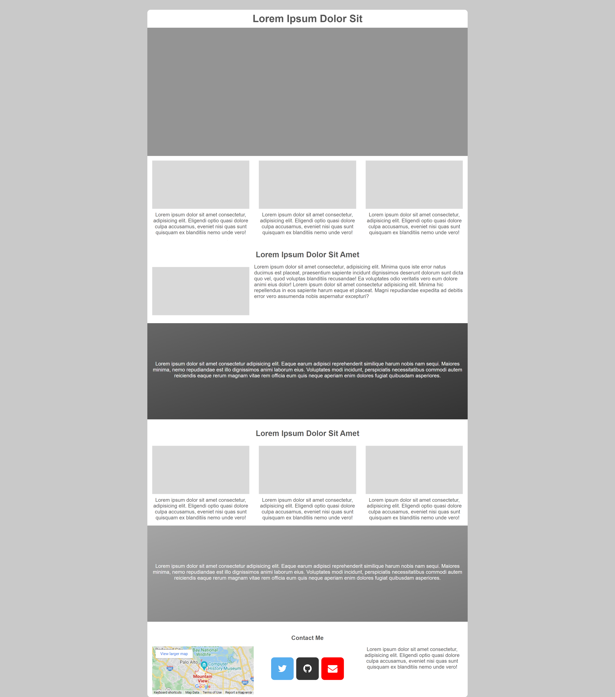

# Portfolio Structure

## Statement

To those trying to start somewhere to build a portfolio, you are free to use it project. In this project, structure fo a responsive portfolio web page was created for almost all devices. This website has passed the test made by [Google](https://search.google.com/test/mobile-friendly). The web page has been developed to be compatible with almost all the devices except Nokia 3310 :(. You are completely free to modify it.

## Preview

You can see the preview of the 1920x4348 pixel web page below.

     

## Contact Me

If you have something to say to me please contact me: 

 - Twitter: [Doguilmak](https://twitter.com/Doguilmak)  
 - Mail address: doguilmak@gmail.com
